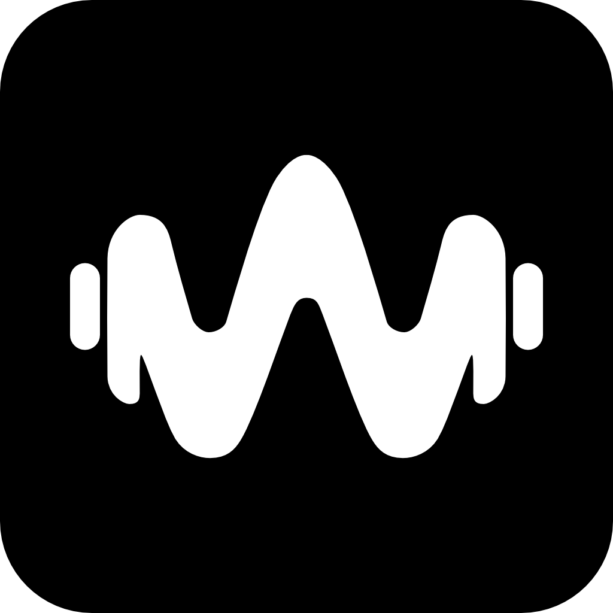

<div align="center">



<h1>
  <br>
  Wavely
</h1>

### 🎵 Le widget audio qui donne vie à votre musique

**Un overlay élégant, fluide et natif pour Windows.**
Spotify, Deezer, TIDAL, Apple Music… un seul widget pour les gouverner tous.

<br>

[](#)
[](#)
[](#)
[](LICENSE.md)

[](https://github.com/seoloon/wavely/releases)
[](#)
[](#)
[](#)

<br>

[**⬇️ Télécharger**](#-installation) &nbsp;·&nbsp;
[**✨ Fonctionnalités**](#-fonctionnalités) &nbsp;·&nbsp;
[**🎨 Presets**](#-les-7-presets) &nbsp;·&nbsp;
[**🛠️ Compiler**](#-compiler-depuis-les-sources) &nbsp;·&nbsp;
[**❓ FAQ**](#-faq)

<br>

</div>

<br>

---

<br>

## 🌊 Qu'est-ce que Wavely ?

**Wavely** est un widget audio flottant et natif pour Windows.
Il se pose au-dessus de vos fenêtres et affiche en temps réel **ce que vous écoutez** — pochette, titre, artiste, progression et **une waveform réactive à l'audio réel de votre système**.

Pas de plugin. Pas de compte. Pas de configuration API.
Wavely écoute directement Windows via **GSMTC** (métadonnées média) et **WASAPI** (capture audio en boucle) — pour les applications qu'il reconnaît (voir [Compatibilité](#-compatibilité) ci-dessous).

<div align="center">
<br>

| 🎧 **4 lecteurs** | ⚡ **Réactif** | 🎨 **Vivant** | 🔒 **Quasi-privé** |
|:---:|:---:|:---:|:---:|
| Spotify, Deezer,<br>TIDAL, Apple Music | Backend natif C++<br>capture WASAPI en direct | Couleurs extraites<br>de la pochette | Aucune télémétrie —<br>seule exception : la vérification de mise à jour |

<br>
</div>

---

<br>

## 🎼 Compatibilité

Wavely lit les métadonnées via l'API Windows **GSMTC** (`GlobalSystemMediaTransportControlsSession`), mais ne réagit qu'à une **liste blanche** d'applications de streaming musical natives.

> ⚠️ **Les navigateurs (Chrome, Edge, Brave…) et VLC ne sont pas reconnus, par choix délibéré.** Un onglet de navigateur qui joue une vidéo (YouTube Music inclus) déclare sa session GSMTC sous l'identité du navigateur lui-même (ex. AUMID `"Brave"`), indistinguable de n'importe quel autre contenu joué dans un autre onglet. Il n'existe pas de moyen fiable d'isoler "juste YouTube Music" via cette API — inclure les navigateurs ferait donc réagir Wavely à **n'importe quelle vidéo**, pas seulement à de la musique.

<div align="center">

| Application | Reconnu par Wavely | Statut |
|:---|:---:|:---|
|  | ✅ | Vérifié en conditions réelles |
|  | ✅ | Best-effort (nom de processus), non re-vérifié récemment |
|  | ✅ | Best-effort (nom de processus), non re-vérifié récemment |
|  | ✅ | Best-effort (nom de processus), non re-vérifié récemment |
|  | ❌ | Tourne dans un navigateur (voir ci-dessus) |
|  | ❌ | Non présent dans la liste blanche |
|  | ❌ | Non présent dans la liste blanche |
|  | ❌ | Exclu par choix (voir ci-dessus) |

</div>

La liste blanche est un simple tableau côté backend (`Core/MusicAppAllowlist.h`) — l'ajout d'un lecteur supplémentaire est possible si son AUMID/nom de processus réel est connu et distinct (voir [Contribuer](#-contribuer)).

---

<br>

## ✨ Fonctionnalités

<br>

### 🎨 Design & Rendu

<table>
<tr>
<td width="50%" valign="top">

#### 🖼️ Formats de pochette
Trois styles de rendu, plus deux effets combinables :

- **▢ Carré** — bords légèrement arrondis
- **◻ Squircle** — courbe superellipse
- **⏺ Vinyle** — disque rotatif, tourne pendant la lecture et se fige en pause
- **✨ Glow** *(toggle indépendant)* — halo lumineux teinté par la pochette
- **🌫️ Flou** *(toggle indépendant)* — pochette en fond flouté

</td>
<td width="50%" valign="top">

#### 🌈 Couleurs dynamiques
La pochette pilote la palette :

- **Extraction K-Means** des teintes dominantes (cover réduite à 50×50)
- Contraste du texte adapté automatiquement (clair/sombre selon le fond)
- **Fond dominant** monochrome (optionnel)
- **Fond flouté** avec la pochette en blur gaussien (optionnel)

</td>
</tr>
<tr>
<td width="50%" valign="top">

#### 📊 Waveform temps réel
Pas une animation décorative — **du vrai audio** :

- Capture **WASAPI Loopback** de la sortie système par défaut
- FFT maison sur **20 bandes log-spaced** (grave → aigu), regroupées/moyennées à l'affichage selon le preset
- Pilotée par événements (pas de polling) : mise à jour à chaque bloc audio reçu
- Buffer circulaire lock-free côté backend

</td>
<td width="50%" valign="top">

#### 🌗 Thèmes
Adaptatif et lisible en toutes circonstances :

- Mode **sombre** & mode **clair**
- **Opacité de fond** ajustable de 0 à 100 %
- Application instantanée, sans redémarrage

</td>
</tr>
</table>

<br>

### ⚙️ Comportement

<table>
<tr>
<td width="33%" valign="top">

#### 🖱️ Manipulation
- **Drag & drop** libre, multi-écrans
- **Redimensionnement** de 50 % à 150 % (molette)
- **Réinitialisation de la taille** en un clic (la position est conservée)
- Sauvegarde automatique de la géométrie

</td>
<td width="33%" valign="top">

#### 🔒 Verrouillage
- **Verrouiller le widget** — fige position et taille
- **Click-Through** — le widget devient invisible à la souris, les clics passent au travers (`WS_EX_TRANSPARENT`)

</td>
<td width="33%" valign="top">

#### 👻 Masquage intelligent
- **Masquer en pause** automatique (optionnel)
- **Délai configurable** de 5 s à 30 s
- Fondu enchaîné à l'apparition/disparition
- Réapparition instantanée à la reprise

</td>
</tr>
</table>

<br>

### 🚀 Système

<div align="center">

| | |
|:---|:---|
| 🔔 **System Tray** | Wavely vit discrètement dans la zone de notification. Clic droit → Paramètres, Recharger le widget, Lancer au démarrage, Quitter. |
| 🔄 **Lancement au démarrage** | Optionnel, activable depuis les Paramètres ou le menu du tray. |
| 🆙 **Mise à jour automatique** | Vérifie et télécharge les nouvelles versions depuis les [GitHub Releases](https://github.com/seoloon/wavely/releases) du projet (via Velopack) — au démarrage et depuis l'onglet À propos. Voir [Confidentialité](#-confidentialité). |
| 🌍 **Multilingue** | Architecture i18n complète (`.resx`). **Français** disponible ; autres langues à venir. |
| 🛠️ **Dépannage** | Bouton *Recharger le widget* : réinitialise le hook GSMTC et le rendu, accessible depuis chaque section des Paramètres. |

</div>

---

<br>

## 🎨 Les 7 Presets

Wavely propose **sept dispositions** distinctes, sélectionnables dans Paramètres → Apparence.

<div align="center">

| Preset | Disposition |
|:---|:---|
| **Compact** | Pochette + titre/artiste sur une ligne — l'essentiel, en petit format |
| **Boxy** | Pochette plus grande en carte, informations et contrôles en dessous |
| **Gallery** | Mise en page en grille, pochette mise en avant |
| **Minimal** | Mini-pochette (34 px) + une seule ligne de texte — ultra discret |
| **macOS** | Barre de titre façon notification média macOS |
| **Shell** | En-tête sombre façon console/shell |
| **Discord** | Barre "now playing" façon indicateur d'activité Discord |

<br>

> 💡 Le rendu détaillé de chaque preset (contrôles, waveform, animations play/pause) dépend de sa disposition — tous partagent le même `SettingsViewModel`/`AppConfig`, seul l'affichage change.

</div>

---

<br>

## 📥 Installation

<br>

### Option 1 — Version portable *(recommandée)*

```
1. Téléchargez  Wavely-win-Portable.zip     (page Releases, lien ci-dessous)
2. Extrayez le dossier où vous voulez
3. Lancez     Wavely.App.exe
```

> ✅ Aucune installation · ✅ Aucun droit administrateur · ✅ Supprimable en un glisser-déposer

<br>

### Option 2 — Installeur

```
1. Téléchargez  Wavely-win-Setup.exe        (page Releases, lien ci-dessous)
2. Suivez l'assistant
3. Wavely démarre et s'installe dans le tray
```

Les deux options sont publiées sur la page **[Releases](https://github.com/seoloon/wavely/releases)** du dépôt. L'installeur se met ensuite à jour tout seul (voir [Confidentialité](#-confidentialité)) ; la version portable se met à jour de la même façon si vous la relancez régulièrement.

<br>

<div align="center">

**Configuration requise**

| | |
|:---|:---|
| 💻 **OS** | Windows 10 (2004+) ou Windows 11 |
| 🎮 **GPU** | Recommandé : accélération matérielle pour les effets (glow, flou) |

<sub>RAM/disque/CPU précis non encore mesurés formellement pour la version C++ / Avalonia actuelle — à documenter après la campagne de tests de charge (Phase 8 de `claude/PLAN.md`).</sub>

</div>

---

<br>

## 🛠️ Compiler depuis les sources

<br>

> ℹ️ Le dépôt contient encore un ancien prototype C++/Qt6 (`src/`, `CMakeLists.txt` à la racine) issu des toutes premières itérations du projet. **Il n'est plus l'implémentation active** : l'application réellement construite et distribuée aujourd'hui vit dans `backend/` (C++/WinRT) + `frontend/` (C#/Avalonia), décrite ci-dessous.

### Prérequis

<div align="center">

| Outil | Version |
|:---|:---|
|  | 2022 · workload *Desktop development with C++* (MSVC v143 + Windows SDK) |
|  | **8.0** |
|  | `dotnet tool install -g vpk` *(uniquement pour packager un installeur)* |

</div>

<br>

### Build

```powershell
# 1 · Cloner le dépôt
git clone https://github.com/seoloon/wavely.git
cd wavely

# 2 · Restaurer les packages backend (une seule fois)
.\restore-packages.ps1

# 3 · Compiler backend (C++/WinRT) + frontend (Avalonia)
.\build.ps1                     # -Configuration Debug (défaut) ou Release

# 4 · Lancer
.\frontend\Wavely.App\bin\Debug\net8.0-windows10.0.19041.0\Wavely.App.exe
```

Tous les scripts de build (`restore-packages.ps1`, `build.ps1`, `package.ps1`, `release.ps1`) vivent à la racine du dépôt — détails complets dans **[`BUILD.md`](BUILD.md)**.

<br>

<details>
<summary><b>📁 Structure du projet</b></summary>

<br>

```
wavely/
├── 📂 backend/Wavely.Backend/     # Composant WinRT (C++20, runtime class .winmd)
│   ├── MediaSessionManager.cpp    # Intégration GSMTC + liste blanche
│   ├── WaveformEngine.cpp         # Capture WASAPI Loopback + FFT
│   ├── AppConfig.cpp              # Persistance JSON (settings.json)
│   ├── AutoStartManager.cpp       # Clé registre Run
│   ├── 📂 Core/                   # RAII wrappers, ColorExtractor (K-Means), MusicAppAllowlist
│   └── Wavely.Backend.vcxproj
├── 📂 frontend/Wavely.App/        # Application Avalonia (C#/.NET 8)
│   ├── 📂 Views/                  # MainWindow (widget), SettingsWindow
│   │   └── 📂 Presets/            # Les 7 dispositions (Compact, Boxy, Gallery, Minimal, macOS, Shell, Discord)
│   ├── 📂 ViewModels/             # SettingsViewModel (CommunityToolkit.Mvvm)
│   ├── 📂 Controls/               # WaveformControl, CoverArtControl, PresetCatalog
│   ├── 📂 Services/               # AppTrayIcon, UpdateService, PlaybackPositionTracker
│   ├── 📂 Resources/              # Strings.resx (i18n)
│   └── Wavely.App.csproj
├── 📂 assets/                     # Logo, icône
├── 📂 docs/                       # ADR — décisions d'architecture, notes techniques
├── 📂 claude/                     # PROMPT.md · PLAN.md · RULES.md (suivi du développement)
├── build.ps1 / package.ps1 / release.ps1 / restore-packages.ps1
└── src/ · CMakeLists.txt          # Ancien prototype Qt6 — non actif, voir note ci-dessus
```

</details>

---

<br>

## 🧬 Sous le capot

<div align="center">

```
┌──────────────────────────────────────────────────────────────┐
│         BACKEND — Wavely.Backend (C++20 / WinRT .winmd)       │
├──────────────────────────────────────────────────────────────┤
│                                                              │
│   ┌────────────────┐            ┌──────────────────┐         │
│   │     GSMTC      │            │  WASAPI Loopback │         │
│   │  + Allowlist   │            │   (COM/Win32)    │         │
│   └───────┬────────┘            └────────┬─────────┘         │
│           │ métadonnées                  │ PCM brut          │
│           │ pochette · état              │                   │
│           ▼                              ▼                   │
│   ┌────────────────┐            ┌──────────────────┐         │
│   │ MediaSession   │            │  Ring Buffer     │         │
│   │    Manager     │            │   lock-free      │         │
│   └───────┬────────┘            └────────┬─────────┘         │
│           │                              │                   │
│           ▼                              ▼                   │
│   ┌────────────────┐            ┌──────────────────┐         │
│   │ ColorExtractor │            │ WaveformEngine   │         │
│   │    K-Means     │            │ FFT · 20 bandes  │         │
│   └───────┬────────┘            └────────┬─────────┘         │
│           │ palette                      │ spectre           │
└───────────┼──────────────────────────────┼───────────────────┘
            │  Microsoft.Windows.CsWinRT (projection C#)        │
┌───────────┼──────────────────────────────┼───────────────────┐
│           ▼                              ▼                   │
│              ┌───────────────────────┐                       │
│              │   SettingsViewModel   │                       │
│              │  (CommunityToolkit)   │                       │
│              └───────────┬───────────┘                       │
│                          ▼                                   │
│              ┌───────────────────────┐                       │
│              │  Preset View (AXAML)  │                       │
│              └───────────┬───────────┘                       │
│                          ▼                                   │
│              ┌───────────────────────┐                       │
│              │  MainWindow (Widget)  │                       │
│              │ Avalonia · frameless  │                       │
│              └───────────────────────┘                       │
│      FRONTEND — Wavely.App (C# / .NET 8 / Avalonia UI)        │
└──────────────────────────────────────────────────────────────┘
```

</div>

<br>

<div align="center">

### 🏆 Engagements techniques

| | |
|:---|:---|
| 🔐 **RAII intégral (backend)** | Chaque handle système est wrappé (`Core/Handle.h`, `ComPtr.h`, `RegistryKey.h`) |
| 🧵 **Capture audio isolée** | WASAPI Loopback tourne sur son propre thread, publie via un ring buffer lock-free |
| 🎯 **Séparation stricte** | Backend = 100 % C++/WinRT (logique métier, accès système) · Frontend = 100 % C#/Avalonia (UI) |
| 🛡️ **Zéro warning backend** | Compilé en `/W4` sans tolérance |
| 🆙 **Mises à jour vérifiables** | Distribution via Velopack + GitHub Releases, pas de serveur privé |

</div>

---

<br>

## 🔒 Confidentialité

<div align="center">

> ### **Wavely ne fait qu'une seule chose sur le réseau : vérifier les mises à jour.**

</div>

<br>

| | |
|:---|:---|
| 🌐 **Une connexion réseau** | Au démarrage et depuis l'onglet *À propos*, Wavely interroge les [GitHub Releases](https://github.com/seoloon/wavely/releases) du projet (via Velopack/`GithubSource`) pour savoir si une nouvelle version existe, et la télécharge si vous l'acceptez. Cette vérification n'est pas encore désactivable depuis les Paramètres. |
| 🚫 **Aucune télémétrie** | Pas d'analytics, pas de crash reporting distant, aucune donnée d'usage envoyée. |
| 🚫 **Aucun enregistrement** | Les buffers audio WASAPI sont traités en mémoire pour la FFT puis jetés. Rien n'est écrit sur le disque. |
| ✅ **Données locales** | Vos préférences (position, thème, preset…) sont stockées dans `%AppData%\Wavely\settings.json`, lues/écrites uniquement par le backend. |
| ✅ **Open source** | Le code est intégralement auditable. |

---

<br>

## 🗺️ Roadmap

<div align="center">

| Statut | Version | Contenu |
|:---:|:---|:---|
| ✅ | **0.2.0** *(actuelle)* | 7 presets · waveform WASAPI · couleurs dynamiques · tray · paramètres complets · mise à jour automatique |
| 🚧 | **Phase 8** | Robustesse (edge cases, gestion mémoire, tests de charge), mesures RAM/CPU réelles, build Release final |
| 📋 | **1.x** | 🌍 Anglais, Espagnol, Allemand · éditeur de presets visuel · désactivation de la vérification de mise à jour |
| 💭 | *(à l'étude)* | Raccourcis clavier globaux · profils multi-écrans · thèmes communautaires |

<sub>✅ Publié &nbsp;·&nbsp; 🚧 En cours &nbsp;·&nbsp; 📋 Planifié &nbsp;·&nbsp; 💭 À l'étude — suivi détaillé phase par phase dans <code>claude/PLAN.md</code>.</sub>

</div>

---

<br>

## ❓ FAQ

<details>
<summary><b>La waveform ne bouge pas, pourquoi ?</b></summary>
<br>
Wavely capture la <b>sortie audio par défaut</b> de Windows. Si votre lecteur envoie le son vers un autre périphérique (casque USB, sortie HDMI…), changez le périphérique de sortie par défaut dans les paramètres son de Windows, puis cliquez sur <b>Recharger le widget</b>.
</details>

<details>
<summary><b>La pochette ne s'affiche pas</b></summary>
<br>
Wavely ne réagit qu'à Spotify, Deezer, TIDAL et Apple Music (voir <a href="#-compatibilité">Compatibilité</a>) — les navigateurs et VLC ne sont pas reconnus. Si l'app est bien l'une de ces quatre et que la pochette reste absente, Wavely affiche un visuel de repli et utilise la palette du thème actif.
</details>

<details>
<summary><b>Pourquoi YouTube Music / VLC / mon navigateur ne fonctionne pas ?</b></summary>
<br>
C'est un choix délibéré, pas un bug : un onglet de navigateur déclare sa session média sous l'identité du navigateur, indistinguable de n'importe quel autre contenu joué dans un autre onglet. Réagir aux navigateurs ferait donc réagir Wavely à <b>n'importe quelle vidéo</b>, pas seulement à de la musique. Voir <a href="#-compatibilité">Compatibilité</a>.
</details>

<details>
<summary><b>Comment désactiver le Click-Through une fois activé ?</b></summary>
<br>
Le widget ne réagit plus aux clics — c'est normal. Ouvrez les paramètres via <b>l'icône du tray → Paramètres → Comportement</b> et désactivez l'option.
</details>

<details>
<summary><b>Wavely fonctionne-t-il en jeu / plein écran ?</b></summary>
<br>
Oui en mode <b>fenêtré</b> et <b>fenêtré sans bordure</b>. En plein écran exclusif, Windows empêche tout overlay tiers de s'afficher — c'est une limitation du système, pas de Wavely.
</details>

<details>
<summary><b>Quel est l'impact sur les performances ?</b></summary>
<br>
Le backend (capture GSMTC/WASAPI, FFT, extraction de couleurs) est du C++20 natif. Le frontend est une application <b>.NET 8/Avalonia</b> : plus léger qu'un overlay basé sur un navigateur embarqué (pas d'Electron/Chromium), mais avec le runtime .NET habituel — pas "zéro runtime". Des chiffres RAM/CPU précis pour cette architecture seront publiés après la campagne de tests de charge (voir Roadmap).
</details>

<details>
<summary><b>Puis-je créer mon propre preset ?</b></summary>
<br>
Pas encore facilement : les 7 presets actuels sont des vues Avalonia compilées (C#/AXAML), pas des fichiers de configuration externes. Un éditeur de presets visuel est envisagé pour une version ultérieure (voir Roadmap).
</details>

---

<br>

## 🤝 Contribuer

Les contributions sont les bienvenues !

```bash
# Convention de commits : Conventional Commits
feat:     nouvelle fonctionnalité
fix:      correction de bug
perf:     amélioration de performance
refactor: refonte sans changement fonctionnel
docs:     documentation
chore:    maintenance, build, dépendances
```

<br>

Avant toute Pull Request, merci de lire **[`claude/RULES.md`](claude/RULES.md)** — les règles de développement du projet (stack autorisée, conventions de nommage, exigences de performance et de qualité).

<br>

<div align="center">

| | |
|:---|:---|
| 🐛 **Un bug ?** | [Ouvrir une issue](../../issues/new?labels=bug) |
| 💡 **Une idée ?** | [Proposer une fonctionnalité](../../issues/new?labels=enhancement) |
| 💬 **Une question ?** | [Démarrer une discussion](../../discussions) |

</div>

---

<br>

## 📜 Licence

Distribué sous licence **MIT** — voir le fichier [`LICENSE.md`](LICENSE.md).

<br>

## 🙏 Remerciements

<div align="center">

**Avalonia UI · Microsoft.Windows.CsWinRT · CommunityToolkit.Mvvm · Velopack · nlohmann/json**

Et à toutes les personnes qui testent, signalent et améliorent Wavely. 💜

</div>

<br>
<br>

---

<div align="center">


### **Wavely**

*Votre musique mérite mieux qu'une barre des tâches.*

<br>

**Fait avec ❤️, du C++ et du C#**

<br>

[](../../stargazers)

<sub>© 2026 Wavely</sub>

</div>
